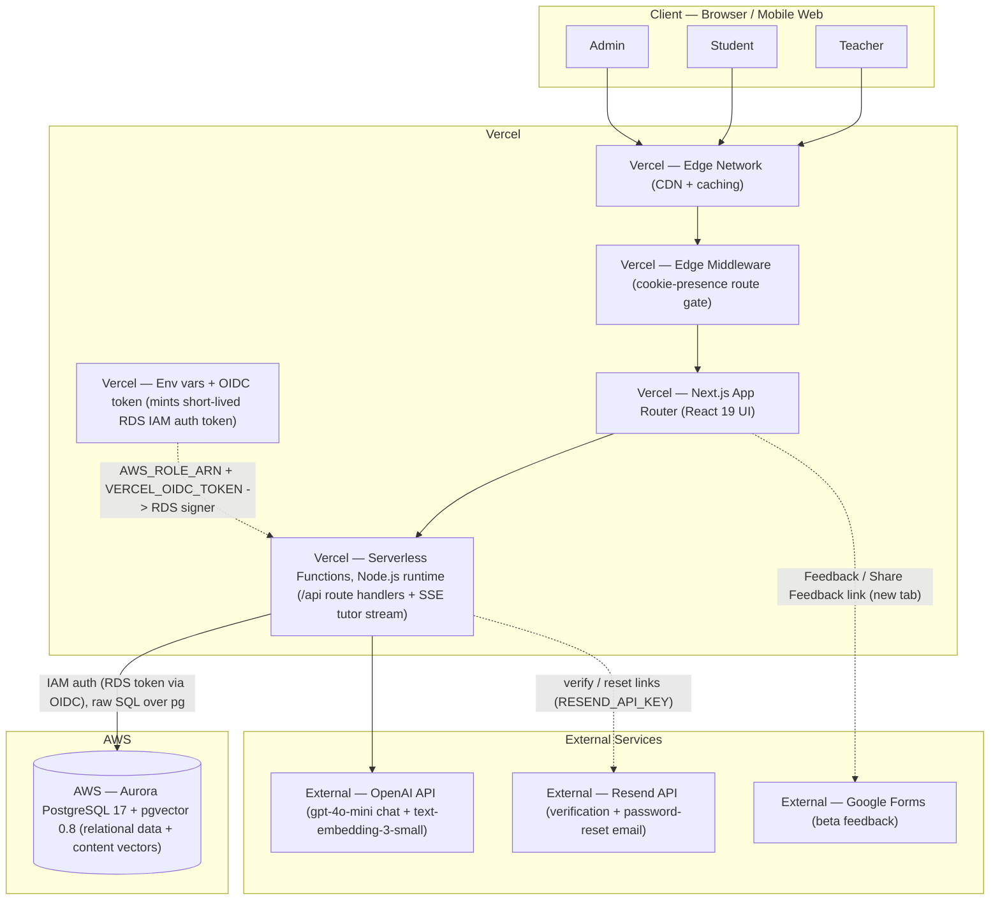
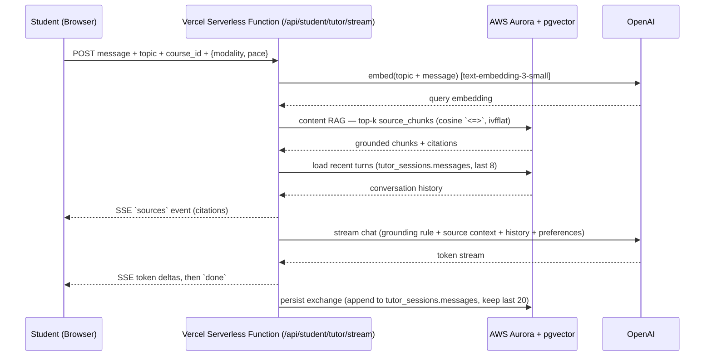
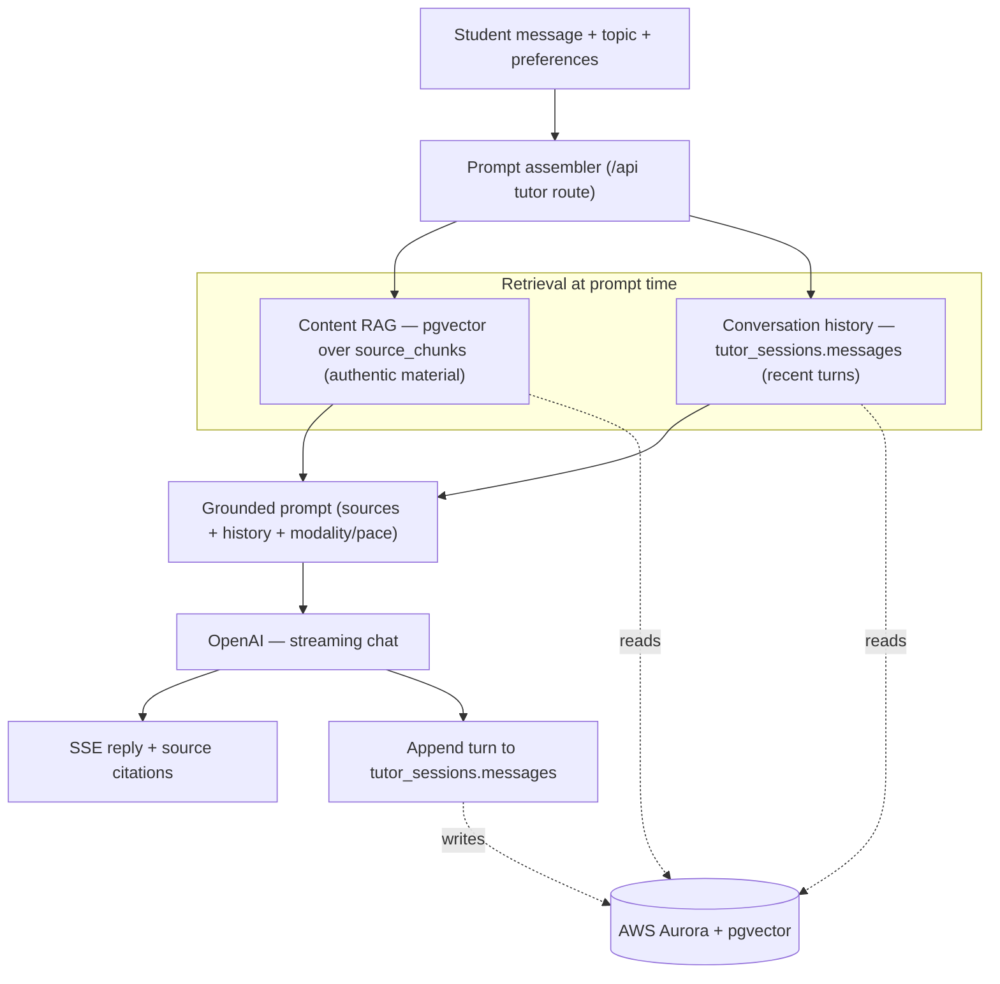
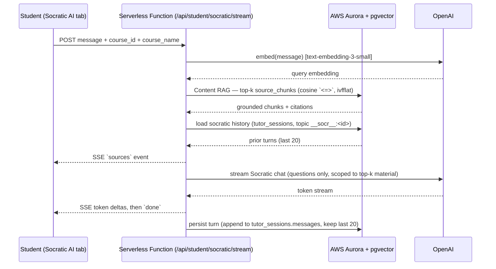

# EdSynapse — System Architecture

> **One-line:** An AI tutor that adapts to your learning preferences — grounding
> every lesson in your own material and checking your understanding as it goes.

This document is both the product map and the **architecture diagram** for the
H0 hackathon submission (Open Innovation track). Every service is labelled with
its provider so it's clear what runs on **Vercel** vs **AWS** vs **external**
services.

**Product shape:** B2C, three roles — **teacher**, **student** (class-enrolled
*or* self-serve from their own uploads), and **admin** (platform operations) —
launching as a free 1-month public beta. Live at
<https://edsynapse-beta.vercel.app>.

---

## Provider legend

| Prefix | Provider | Notes |
|--------|----------|-------|
| **Vercel –** | Vercel | Frontend hosting, serverless + edge compute, env/secrets, OIDC identity |
| **AWS –** | Amazon Web Services | Aurora PostgreSQL + pgvector (relational data **and** vector store) |
| **External –** | 3rd-party | OpenAI (chat + embeddings); Resend (transactional email); Google Forms (beta feedback) |

> **Auth is first-party**, not an external service: custom email/password on
> Aurora (`src/lib/auth.ts`) — scrypt-hashed passwords, opaque session tokens in
> the `sessions` table, referenced by an httpOnly cookie. There is no Clerk.
> Email **delivery** (verification + password reset) is the one outsourced piece,
> via Resend's HTTPS API. The full auth model, flows, and Resend setup live in
> [`auth.md`](auth.md).

---

## 1. System diagram



**Notes on the real wiring:**

- **No connection string / no password.** `src/lib/db.ts` assumes `AWS_ROLE_ARN`
  using the request-scoped `VERCEL_OIDC_TOKEN` and mints a short-lived RDS auth
  token per connection (`@aws-sdk/rds-signer`). There is no `DATABASE_URL`, no
  RDS Proxy, and no S3 — uploaded files are parsed to text in-process
  (`unpdf`/`mammoth`/`xlsx`) and stored in the `sources.content` column.
- **Edge middleware does no DB work** — `src/middleware.ts` is a cookie-presence
  gate that redirects unauthenticated users off `/teacher|/student|/admin` and
  logged-in users off `/sign-in|/sign-up` (to `/`, since the edge can't read the
  role). Real auth + role checks happen server-side in each route handler via
  `requireUser(role?)`.
- **Login is unified, not portal-split.** One `/sign-in` form; the account's real
  `role` (DB) decides the destination — there is no "student vs teacher" toggle to
  pick the wrong portal. Login is rate-limited (`src/lib/rateLimit.ts`) and
  email verification + password reset run on Resend (see [`auth.md`](auth.md)).
- **Response security headers** (HSTS, X-Frame-Options: DENY, nosniff,
  Referrer-Policy, Permissions-Policy) are set for every route in
  `next.config.ts`, complementing the httpOnly session cookie.
- **The tutor stream is a Node.js serverless function** (`runtime = "nodejs"`,
  `maxDuration = 60`), not an Edge function — it needs the `pg` and OpenAI SDKs.

---

## 2. The crown-jewel flow — grounded streaming tutor (RAG over SSE)

This is the flow that proves the core claim — *the tutor grounds itself in your
own material* — and best shows the backend connections for judging. Each tutor
turn retrieves course material by vector similarity, replays recent conversation,
and streams a grounded reply back over Server-Sent Events.



If a course has **no embedded material**, `retrieve()` returns `[]` and the tutor
falls back to accurate general knowledge (the grounding rule forbids contradicting
sources, never inventing citations) — so the loop still works for an empty class.

---

## 3. What the tutor reads — grounding + memory model

EdSynapse assembles each tutor turn from a few clearly-separated inputs. There is
one vector workload (content RAG); everything else is plain relational state.

| Input | What it holds | Where it lives | Lifetime |
|-------|---------------|----------------|----------|
| **Content RAG** | The authentic material, chunked (~1200 chars, 150 overlap) and embedded | `source_chunks` — `vector(1536)`, ivfflat cosine index | Per course |
| **Conversation history** | Recent turns for this student + course + topic (last 8 sent to the model, last 20 persisted) | `tutor_sessions.messages` (JSONB) | Across sessions on that topic |
| **Durable tutor memory** | A rolling 3-sentence summary + ≤8 stable facts about the learner (what they grasp, struggle with, goals) — survives a chat "reset" | `tutor_sessions.memory` (JSONB) | Durable per student+course+topic; refreshed by an LLM consolidation pass after each turn |
| **Strengths & Gaps** | Mastery per topic — `strong` / `moderate` / `needs_improvement` + evidence | `knowledge_states` (unique per student+course+topic) | Durable; updated by grading |
| **Learning preferences** | Modality (`visual` / `text` / `audio` / `all`) + pace (`deep` / `methodical` / `regular`) | Set at onboarding (`users.learning_modality` / `learning_pace`), applied per request | Durable on the profile |



**The strengths & gaps map updates on a separate path** — not from tutor chat, but from
**graded quizzes**. The diagnostic quiz seeds it, and each verify-stage
assessment grade upserts the relevant topic's mastery level
(`src/lib/knowledge.ts` → `scoreToLevel` / `upsertKnowledgeState`). That map then
drives what the student sees in their personal strengths & gaps view and the teacher's
cohort analytics.

After each turn the tutor route runs a small, non-blocking **LLM consolidation
pass** (`updateTutorMemory` in `src/lib/llm.ts`) that merges the latest exchange
into `tutor_sessions.memory` — a condensed summary + a handful of durable facts.
This memory is replayed into the next turn's system prompt and, unlike
`messages`, **survives a chat "reset"**, so the tutor keeps remembering the
learner even after the visible conversation is cleared.

> **Honest scope note:** the durable memory is a *relational* JSONB tier, not a
> separate semantic/vector learner-memory store. Personalisation today comes from
> (a) grounding in the learner's own uploaded material, (b) per-topic conversation
> history, (c) the rolling memory summary, (d) the mastery map from graded work,
> and (e) the modality/pace preference applied to the prompt. A semantic
> learner-memory tier (embedded misconceptions, analogies that landed) remains a
> clean future addition on the same Aurora + pgvector DB.

---

## 4. Conversational and Collaborative surfaces — three distinct chatbots + Q&A Board

The student class workspace (`/student/class/[code]`) is organised behind a
horizontal navbar with five tabs — Course · Learning · AI Tutor · Socratic AI · Q&A Board.
One tab (**Course**) is a read-only material browser, and the **Q&A Board** is a collaborative forum.
The other three tabs are LLM-driven chat surfaces, each with a different pedagogical role, scope, and retrieval strategy. All three bots stream over the same NDJSON-over-`fetch` transport (`data: {json}` lines: `sources` → `delta`s → `done`) and persist to the single `tutor_sessions` table, disambiguated by the `topic` column.

| Surface (tab) | Route | Scope | Retrieval | `topic` key prefix | Output style |
|---------------|-------|-------|-----------|-------------|--------------|
| **Per-topic Tutor** (Learning) | `/api/student/tutor/stream` | One syllabus topic (inline study) | Content RAG (cosine top-k) + history + durable memory | the topic name (no prefix) | Teaches — explains, checks understanding mid-stream |
| **AI Tutor** (AI Tutor) | `/api/student/tutor/stream` | Whole course (free-form Q&A) | Content RAG (cosine top-k) + history | `__tutor__:<nanoid>` | Answers — direct, grounded explanations |
| **Socratic AI** (Socratic AI) | `/api/student/socratic/stream` | Whole course (dialogue) | Content RAG (cosine top-k) + history | `__socr__:<nanoid>` | Socratic — asks questions, probes overall grasp, guides to discovery |

**Thread isolation and prefixing.** To prevent thread collisions in the shared `tutor_sessions` table, the API route [conversations/route.ts](file:///d:/Semester_3_summer_%282026%29/Coding%20Projects/edsynapse-beta/frontend/src/app/api/student/conversations/route.ts) prefixes thread persistence keys (`tutor_sessions.topic`) based on the surface:
- **AI Tutor**: Prefixed with `__tutor__:` (e.g. `__tutor__:<nanoid>`).
- **Socratic AI**: Prefixed with `__socr__:` (e.g. `__socr__:<nanoid>`).

These prefixes keep each chatbot's saved threads separated. During a streaming turn, the API handler maps the request's human-readable `topic` (the course name) for prompt generation and embedding queries, but uses the prefixed `topic_key` for DB session lookup and updates.

### 4.1 Per-topic Tutor and Course-wide AI Tutor (the teaching engine)

Both run on the same engine (`streamTutorReply` ➔ tutor stream route, see §2–§3). The **Per-topic Tutor** is scoped to a single lesson topic and is used inline inside the Learning study workspace. The **AI Tutor** tab points that exact same engine at the *whole course* (using the course name as `topic` and `__tutor__:<nanoid>` as the persistence key) for free-form "explain anything in this course" Q&A. Output is explanatory and may emit mid-stream comprehension-check prompts.

### 4.2 Socratic AI (Socratic dialogues)

The Socratic AI tab is a dedicated chatbot whose goal is to **assess and deepen the learner's overall understanding of the entire course through dialogue**.
- **Pedagogy**: Its system prompt (`streamSocraticReply` in `src/lib/llm.ts`) forbids lecturing. Instead, it asks probing questions to challenge assumptions, exposes logic gaps, and guides students to discover concepts for themselves.
- **Route**: It streams tokens via `/api/student/socratic/stream` (using `__socr__:<nanoid>` as the persistence key).



**Persistence.** One rolling conversation thread per student+course is stored under a `topicKey` prefixed with `__socr__:` in `tutor_sessions.messages`. Thread management (renaming, deleting, listing) is handled via `GET`/`PATCH`/`DELETE /api/student/conversations`.

### 4.3 Q&A Board (Collaborative discussion forum)

The **Q&A Board** tab hosts a collaborative, Piazza-style course discussion board ([DiscussionBoard.tsx](file:///d:/Semester_3_summer_%282026%29/Coding%20Projects/edsynapse-beta/frontend/src/components/ui/DiscussionBoard.tsx)).
- It allows students and teachers to create public or private discussion threads.
- It supports threaded comments, markdown rendering, and student/teacher badges.
- All data flows through the `/api/student/discussion/*` and `/api/teacher/courses/[id]/discussion/*` endpoints, keeping peer-to-peer discussions separate from AI tutor sessions.

### 4.4 Course tab (material browser, not a bot)

The fifth tab lists every uploaded source for the course (grouped by lesson) and can preview a file's extracted text via `GET /api/courses/[id]/sources/[sourceId]`. It surfaces exactly the material that grounds all three chatbots above. A **Diagnostic Test** launcher also lives in the Learning workspace, running the course-wide diagnostic (`/api/student/diagnose/{quiz,evaluate}`) inline and seeding the knowledge map.

---

## 5. Service inventory

| Service | Provider | Purpose | Status |
|---------|----------|---------|--------|
| Next.js App Router | **Vercel** | UI, routing, role-protected pages | ✅ Live |
| Edge Middleware | **Vercel** | Cookie-presence route gate (no DB at the edge) | ✅ Live |
| Serverless Functions (Node.js) | **Vercel** | `/api/*` route handlers — CRUD, RAG ingest, quiz/assessment gen, grading, **and** the SSE tutor stream | ✅ Live |
| Env vars + OIDC | **Vercel** | `AWS_REGION`, `PGHOST`, `PGUSER`, `PGDATABASE`, `AWS_ROLE_ARN`, `VERCEL_OIDC_TOKEN`, `OPENAI_API_KEY`, `OPENAI_MODEL`, `CRON_SECRET`, `RESEND_API_KEY`, `EMAIL_FROM`, `NEXT_PUBLIC_APP_URL`, `NEXT_PUBLIC_FEEDBACK_URL` (optional) | ✅ Live |
| Aurora PostgreSQL 17 (Serverless v2) | **AWS** | Relational data + vector store, reached via IAM/OIDC auth | ✅ Live |
| pgvector 0.8 | **AWS** | Cosine similarity search over `source_chunks` (content RAG) | ✅ Live |
| OpenAI API | **External** | `gpt-4o-mini` chat (override via `OPENAI_MODEL`), `text-embedding-3-small` embeddings | ✅ Live |
| Resend API | **External** | Transactional email — account verification + password-reset links (`src/lib/email.ts`). No-ops gracefully when `RESEND_API_KEY` is unset | 🔌 Wired (API key pending) |
| Google Forms | **External** | Beta feedback capture — linked from the landing nav and the student/teacher app shell. `src/lib/feedback.ts` ships the published form as the default `FEEDBACK_URL`; `NEXT_PUBLIC_FEEDBACK_URL` overrides it | ✅ Live |

> File parsing (`unpdf`/`mammoth`/`xlsx`) runs in the serverless function; there
> is no S3 bucket — extracted text lives in `sources.content`, vectors in
> `source_chunks`.

---

## 6. How the product works (data flow)

1. **Onboarding (first-party auth).** A user signs up as **teacher** or
   **student** at `/sign-up` (first/last name + a policy-checked password —
   ≥8 chars with a letter, number, and special char; scrypt hash + `sessions`
   row + httpOnly cookie). A **verification email** is sent on signup (Resend);
   verification is *soft* (not required to use the app) and can be re-sent from
   `/settings`. Sign-in is a **single unified form** — the account's real DB
   `role` chooses the destination, with no portal toggle — and is rate-limited.
   Forgotten passwords are recovered via an emailed, single-use, 1-hour reset
   link (`/forgot-password` → `/reset-password`). New accounts are routed through
   a required, role-specific **`/onboarding`** step (education/teaching level,
   program or department, learning style + pace for students, title for teachers)
   before reaching a dashboard; `users.onboarded` gates this. Profiles are
   editable later at **`/settings`**, which also offers hard account deletion
   (password re-verify → `DELETE FROM users` cascade). The **admin** role is
   provisioned directly in the database, not via self-signup. Role gates
   `/teacher/*`, `/student/*`, `/admin/*`. Full detail: [`auth.md`](auth.md).
2. **Material in (Aurora + pgvector).** A teacher uploads course material to a
   class (with a join **code**), *or* a student uploads their own files to create
   a personal `self_study` course. Files are parsed to text in-process, chunked
   (`src/lib/rag.ts`), embedded via **OpenAI**, and stored as `vector(1536)`
   rows in `source_chunks` for grounding.
3. **Diagnose.** An OpenAI-generated diagnostic quiz seeds a per-student
    **strengths & gaps** map (`knowledge_states`: strong / moderate / needs-improvement).
4. **Teach + Check (the loop).** The streaming tutor grounds each turn in
    **content RAG** + **recent conversation history** + **durable memory**, teaches
    in the student's chosen modality/pace, and checks understanding mid-explanation
    (see §2–§3). The student can also generate grounded smart notes and flashcards
    for a topic. The class workspace exposes this behind a five-tab navbar —
    **Course** (material browser), **Learning** (study workspace + inline diagnostic),
    **AI Tutor** (explanatory Q&A bot), **Socratic AI** (dialogue bot), and
    **Q&A Board** (peer-to-peer forum) — detailed in §4.
5. **Verify.** A low-stakes assessment (MCQ + short answer) is auto-graded by
    OpenAI; results upsert the strengths & gaps map, sharpening the next loop.
6. **Admin.** The admin console: a user directory (suspend / reactivate), course
    oversight, and a support inbox of admin ↔ user threads (`support_threads` /
    `support_messages`).
7. **Feedback (beta).** A **Feedback** link in the landing nav and a **Share
   Feedback** link in the student/teacher app shell open the published Google Form
   in a new tab. `src/lib/feedback.ts` ships the live form as the default
   `FEEDBACK_URL` (overridable via `NEXT_PUBLIC_FEEDBACK_URL`). The form branches
   by role — students and teachers answer their own sections — and is anonymous
   (optional email only). No data flows back into the app; responses collect in
   Google Forms.

The data model is built by the numbered, idempotent migrations in
[`../frontend/scripts/`](../frontend/scripts) (`001-init-schema.sql` →
`013-auth-email.sql`), applied in order by `npm run db:setup`. Beyond the core +
admin/support tables, later migrations add `study_materials` (grounded notes /
flashcards, `005`), the `tutor_sessions.memory` durable-memory column (`008`),
conversation-thread titles (`010`), the Q&A board (`discussions` /
`discussion_posts`, `012`), and the auth-email tables (`auth_tokens` /
`login_attempts` + `users.email_verified`, `013` — see [`auth.md`](auth.md)). See
[`../PRD.md`](../PRD.md) for the full product spec.

---

## 7. Deployment

The app is **live** on Vercel (project `edsynapse-beta`, team `awais-projects5`);
pushing to `main` deploys. The Vercel project root directory is `frontend/`, and
`frontend/vercel.json` declares `"framework": "nextjs"` (without it the build
succeeds but serves 404s — the original broken-deploy cause).

Database lifecycle (IAM auth, same OIDC path as the app):

1. Aurora PostgreSQL 17 with `CREATE EXTENSION vector;` (pgvector 0.8).
2. `npm run db:setup` applies the numbered `scripts/*.sql` files in order
   (idempotent — safe to re-run). There is no ORM/migration tool.
3. Env (the AWS/PG IAM set, `OPENAI_API_KEY`, `OPENAI_MODEL`, `CRON_SECRET`, and
   the email set `RESEND_API_KEY` / `EMAIL_FROM` / `NEXT_PUBLIC_APP_URL`) is
   configured per-environment in **Vercel**; locally it's pulled with
   `vercel env pull` (the OIDC token expires ~12 h — re-pull or use `vercel dev`).
   See [`auth.md`](auth.md) for the Resend env setup (local + Vercel).

There is **no automated test suite**; `npm run build` is the correctness gate.

---

## 8. Notes / strategic alternatives

- **Bedrock vs OpenAI.** Uses OpenAI today. For an AWS-judged hackathon, swapping
  the LLM/embeddings to **Amazon Bedrock** would deepen the AWS story. The AI
  layer is isolated behind `src/lib/llm.ts` / `src/lib/openai.ts`, so this is a
  low-cost swap later. The chat model is already env-configurable via
  `OPENAI_MODEL`.
- **IAM/OIDC auth vs a connection string.** EdSynapse reaches Aurora with
  short-lived, request-scoped RDS tokens (no long-lived `DATABASE_URL` secret) —
  a deliberate, AWS-native security posture rather than a static password. The
  trade-off is the local-dev token-refresh gotcha (~12 h).
- **Durable learner memory (future).** A semantic `learner_memory` tier
  (misconceptions, what analogies landed, goals) with an LLM consolidation pass
  would make the tutor more personal over time. It fits the *same* Aurora +
  pgvector instance — a natural extension of the existing content-RAG workload.
- **Why Aurora over DynamoDB.** The domain is highly relational *and* needs
  vector retrieval; Aurora + pgvector does both in one proven DB. (See PRD §6.1.)
```
