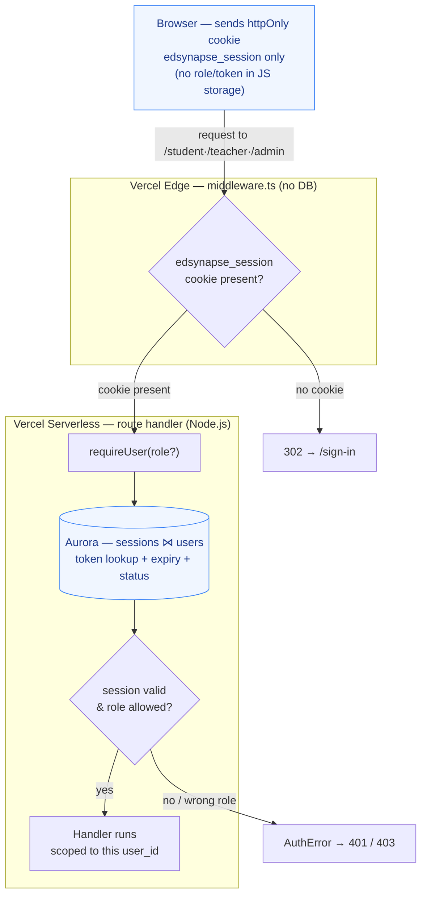
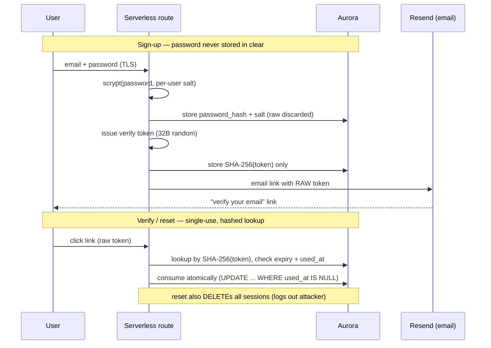

# EdSynapse — Authentication & Email

How auth works end-to-end, and the **step-by-step Resend setup** to make
verification + password-reset emails actually send. Auth is first-party (custom
email/password on Aurora); the only outsourced piece is email *delivery*.

> **TL;DR for tomorrow:** create a Resend account → make an API key → put
> `RESEND_API_KEY`, `EMAIL_FROM`, `NEXT_PUBLIC_APP_URL` in `frontend/.env.local`
> **and** in the Vercel project → restart `npm run dev`. See [§5](#5-resend-setup-step-by-step).
> Until then, the verify/reset link is printed to the dev-server terminal, so the
> flow is fully testable with no key.

---

## 1. The model at a glance

| Concern | Implementation | File |
|---------|----------------|------|
| Passwords | scrypt + per-user 16-byte salt, constant-time compare; policy ≥8 chars incl. letter/number/special | `src/lib/auth.ts` |
| Sessions | opaque `nanoid(40)` token in `sessions` table, 30-day expiry | `src/lib/auth.ts` |
| Session cookie | `edsynapse_session` — **httpOnly**, `secure` (prod), `sameSite=lax` | `src/lib/auth.ts` |
| Edge gate | cookie-presence redirect only (no DB at edge) | `src/middleware.ts` |
| Server authz | `requireUser(role?)` re-checks session + role in every route | `src/lib/auth.ts` |
| Login throttling | DB-backed, per-email + per-IP rolling window | `src/lib/rateLimit.ts` |
| Verify / reset tokens | random, **SHA-256-hashed at rest**, single-use, expiring | `src/lib/authTokens.ts` |
| Email delivery | Resend HTTPS API (no SMTP) | `src/lib/email.ts` |
| Client session hook | `useAuth()` over `/api/auth/me` (SWR) | `src/lib/useAuth.ts` |

**Identity is always derived server-side from the session cookie.** The client
never stores credentials, role, or tokens in `localStorage`/`sessionStorage`.

### Request authentication & privacy flow

Every protected request crosses a **two-layer gate**: a cheap cookie-presence
redirect at the edge, then the *real* authority — a server-side session + role
lookup in Aurora. Nothing trusts client-supplied identity. The annotations call
out where each privacy control sits.



**Privacy controls on this path:**

- **httpOnly + `secure` + `sameSite=lax` cookie** — the session token is never
  readable by JavaScript (XSS can't exfiltrate it) and isn't sent on cross-site
  navigations (baseline CSRF defense).
- **Edge does no DB work and can't read the role** — it only checks cookie
  *presence*, so a forged/expired cookie still fails the real check server-side.
- **Server is the only authority** — `requireUser(role?)` re-reads the session
  from Aurora and re-checks `role` + account `status` on *every* request; the
  client's claimed identity is never trusted.
- **Data at rest is hashed, not stored raw** — passwords (scrypt + per-user salt)
  and verify/reset tokens (SHA-256) are one-way; a DB leak yields nothing
  replayable (see §4).
- **Least-authority handlers** — once authenticated, queries are scoped to the
  resolved `user_id`, so one user can't read another's rows.

### Credential & token lifecycle (privacy at rest)

Secrets that touch the database are **transformed before storage** — the raw
value lives only transiently (in the user's head, or in a one-time email link).



---

## 2. Unified login (no portal toggle)

There is **one** `/sign-in` form. The account's real `role` column decides where
the user lands (`student → /student`, `teacher → /teacher/dashboard`,
`admin → /admin`); admins use the same form. There is no student/teacher tab to
pick the "wrong" portal — the previous toggle was security theater since the DB
role is the only authority.

Because the edge middleware can't read the role (cookie-presence only), a
logged-in user who hits `/sign-in` or `/sign-up` is redirected to `/`, not to a
role dashboard.

After login/register/logout, the client revalidates the `/api/auth/me` SWR cache
(`revalidateSession()` in `src/lib/useAuth.ts`) so pages never act on a stale
"logged out" cache — without this, a freshly signed-up user bounces off
`/onboarding` back to `/sign-in`.

---

## 3. Login rate limiting

`src/lib/rateLimit.ts`, backed by the `login_attempts` table (Vercel runs many
short-lived instances, so an in-memory limiter wouldn't hold).

- Records **failed** attempts keyed by email and by client IP (`x-forwarded-for`).
- Blocks with **HTTP 429** when, in the last **15 min**, an email has ≥ **5**
  failures or an IP has ≥ **20** (IP threshold higher for shared campus NATs).
- Cleared for an email on successful login; old rows pruned opportunistically.
- The `/api/auth/forgot-password` route reuses the same limiter to stop reset
  email-bombing / account enumeration.

---

## 4. Email verification & password reset

Both use single-use tokens (`src/lib/authTokens.ts`, table `auth_tokens`):

- The **raw** token is random 32-byte base64url, embedded only in the emailed
  link. Only its **SHA-256 hash** is stored — a DB leak can't be replayed.
- Tokens are looked up by hash, checked for expiry + prior use, and consumed
  atomically (`UPDATE ... WHERE used_at IS NULL`) to prevent double-use races.
- TTL: **verify 24 h**, **reset 1 h**. Issuing a new token of a kind invalidates
  the previous unused one.

### Flows

| Flow | Trigger | Route(s) | Page(s) |
|------|---------|----------|---------|
| Verify email | Sent on signup; re-send from Settings | `POST /api/auth/register`, `/api/auth/resend-verification`, `/api/auth/verify-email` | `/verify-email`, Settings banner |
| Password reset | "Forgot password?" on sign-in | `POST /api/auth/forgot-password`, `/api/auth/reset-password` | `/forgot-password`, `/reset-password` |

Security properties:

- **No account enumeration.** `forgot-password` always returns the same generic
  response whether or not the email exists.
- **Reset revokes all sessions.** On a successful reset we
  `DELETE FROM sessions WHERE user_id = …`, logging out any attacker, and mark the
  email verified (the link proves email ownership).
- **Soft verification.** Login is *not* blocked on unverified email (avoids
  lockout if delivery flakes during the beta). A Settings banner offers re-send.
  To hard-block, gate on `email_verified` in `src/app/api/auth/login/route.ts`.

### Data model (migration `frontend/scripts/013-auth-email.sql`)

```sql
users.email_verified  boolean NOT NULL DEFAULT false
auth_tokens(id, user_id, kind 'verify'|'reset', token_hash UNIQUE, expires_at, used_at, created_at)
login_attempts(id, email, ip, created_at)
```

> ⚠️ **`getSessionUser()` now SELECTs `email_verified`.** This migration must be
> applied (`npm run db:setup`) or every authenticated request fails. It's already
> applied to the current Aurora DB; re-run is idempotent.

---

## 5. Resend setup (step by step)

Do this once to make real emails send. Code already integrates Resend and
**no-ops gracefully** when the key is absent (logs `RESEND_API_KEY not set`).

### Step 1 — Create a Resend account
1. Go to <https://resend.com> → **Sign Up** (email, or GitHub/Google).
2. **Note which email you sign up with** — it matters in Step 4.

### Step 2 — Create an API key
1. Dashboard → **API Keys** (<https://resend.com/api-keys>) → **Create API Key**.
2. Name it (e.g. `edsynapse-dev`), permission **Full access** (or sending), **Create**.
3. **Copy the key now** (`re_…`) — it is shown only once. Lost it? Delete and recreate.

### Step 3 — Local env (`frontend/.env.local`)
```bash
RESEND_API_KEY="re_paste_your_key_here"
EMAIL_FROM="EdSynapse <onboarding@resend.dev>"
NEXT_PUBLIC_APP_URL="http://localhost:3000"
```
`.env.local` is gitignored — never commit the key.

### Step 4 — Free-tier sending rule (important)
With the shared `onboarding@resend.dev` sender, Resend **only delivers to the
email you registered your Resend account with**. Test by signing up / requesting
reset with *that* email. Sending to any other address is dropped until you verify
a domain (Step 6).

### Step 5 — Restart & test
```bash
cd frontend
npm run dev     # env is read at startup — a restart is REQUIRED
```
Sign up with your Resend account email → check inbox. Every attempt (and its
delivery status / errors) is logged at <https://resend.com/emails>.

### Step 6 — (Production) send to anyone
1. Resend → **Domains → Add Domain**; add the DNS records at your registrar.
2. Once verified, set `EMAIL_FROM="EdSynapse <noreply@yourdomain.com>"`.

### Step 7 — Vercel env (for the live deploy)
Vercel → Project `edsynapse-beta` → **Settings → Environment Variables**, add for
**Production** (and Preview/Development as desired):

| Key | Value |
|-----|-------|
| `RESEND_API_KEY` | your `re_…` key |
| `EMAIL_FROM` | `EdSynapse <noreply@yourdomain.com>` (or the test sender) |
| `NEXT_PUBLIC_APP_URL` | `https://edsynapse-beta.vercel.app` |

Redeploy (or push to `main`) so the new env is picked up. `NEXT_PUBLIC_APP_URL`
ensures emailed links point at the right origin.

---

## 6. Testing locally without a key

When `RESEND_API_KEY` is unset and `NODE_ENV !== production`, the verify/reset
link is printed to the dev-server terminal (`logDevLink` in `src/lib/email.ts`):

```
[email:dev] verify email link (email not configured):
http://localhost:3000/verify-email?token=…
```

Paste it into the browser to exercise the exact same secure flow (the token is
still hashed in the DB, single-use, and expiring). This logging is a no-op once a
key is set and never runs in production.

---

## 7. File map

```
src/lib/auth.ts                         passwords, sessions, requireUser, SessionUser
src/lib/authTokens.ts                   issue/consume verify+reset tokens (hashed)
src/lib/rateLimit.ts                    DB-backed login throttling
src/lib/email.ts                        Resend send, email templates, dev-link log, appBaseUrl
src/lib/useAuth.ts                      client: useAuth, login/register/logout, reset/verify helpers
src/middleware.ts                       edge cookie-presence gate
next.config.ts                          security response headers
src/app/api/auth/login                  unified login + rate limit
src/app/api/auth/register               signup + sends verification email
src/app/api/auth/forgot-password        request reset (generic response, rate-limited)
src/app/api/auth/reset-password         consume reset token, set password, revoke sessions
src/app/api/auth/verify-email           consume verify token
src/app/api/auth/resend-verification    re-send verify email (signed-in)
src/app/{sign-in,forgot-password,reset-password,verify-email}/page.tsx   auth pages
scripts/013-auth-email.sql              email_verified + auth_tokens + login_attempts
```

---

## 8. Hardening backlog (not yet done)

- **Nonce-based CSP** for scripts — the strongest remaining XSS mitigation; needs
  a nonce minted in `middleware.ts` and threaded through, plus careful testing
  (a too-strict CSP silently breaks Next's inline hydration scripts).
- **Hard email-verification gate** at login, if/when delivery is reliable.
- **Generic CSRF tokens** — currently relying on `sameSite=lax` cookies, which
  covers the common cases for these POST mutations.
